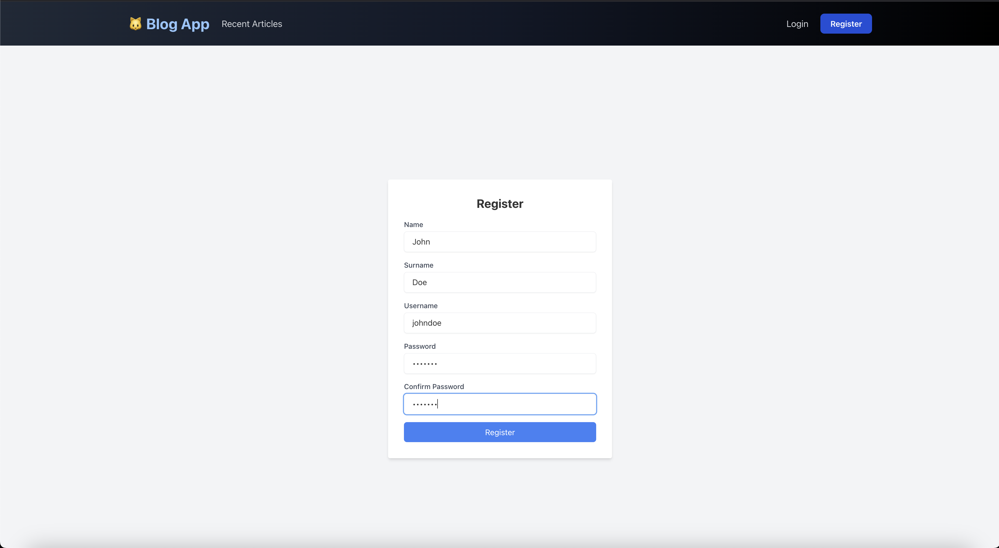

# blog_app
A single-user blogging engine with post creation, comments, and voting, featuring secure login, real-time updates, and REST/GraphQL APIs.

## Prerequisites
This application provides a platform to create, publish, and interact with blog posts.

### Build on
Build on MacOS Sequoia 15.0.1

## Files structure
```blog_app/
├── backend/
│   ├── Dockerfile
│   ├── multer.config.ts
│   ├── nest-cli.json
│   ├── package.json
│   ├── prisma/
│   │   └── schema.prisma
│   ├── src/
│   │   ├── app.controller.ts
│   │   ├── app.module.ts
│   │   ├── articles/
│   │   ├── auth/
│   │   ├── comments/
│   │   ├── users/
│   │   ├── votes/
│   │   └── main.ts
│   ├── test/
│   └── tsconfig.json
├── frontend/
│   ├── Dockerfile
│   ├── package.json
│   ├── src/
│   │   ├── App.tsx
│   │   ├── components/
│   │   │   ├── Button.tsx
│   │   │   ├── Footer.tsx
│   │   │   └── Navbar.tsx
│   │   ├── context/
│   │   │   └── AuthContext.tsx
│   │   ├── pages/
│   │   │   ├── About.tsx
│   │   │   ├── ArticleDetail.tsx
│   │   │   ├── Login.tsx
│   │   │   ├── PrivacyPolicy.tsx
│   │   │   ├── RecentArticles.tsx
│   │   │   ├── Register.tsx
│   │   │   ├── TermsOfService.tsx
│   │   │   └── user/
│   │   ├── services/
│   │   │   ├── articleService.ts
│   │   │   └── authService.ts
│   │   └── styles/
│   │       └── globals.css
├── docker-compose.yml
└── README.md
```

## Files structure
User Authentication: Register with a unique username and password.  
Create and Manage Articles: Write, edit, and delete your articles.  
Commenting System: Add comments to articles and interact with the community.  
Comment Voting: Upvote or downvote comments to promote engaging discussions.

## Step-by-Step Setup

1. Clone the Repository
First open a new terminal window and clone the repository:
```bash
git clone https://github.com/jaroslavdusek1/blog_app/
cd blog_app
```

2. Run the Application with Docker
Run Docker in a Single Command Sequence
For Linux:
```bash
sudo systemctl start docker && sudo systemctl status docker && docker --version
```

For macOS:
On macOS, Docker Desktop needs to be launched manually. Use this command to check Docker's version and confirm it's running:
```bash
docker --version
```

After confirming Docker is running, navigate to the directory containing your docker-compose.yml (/blog_app) file and run the application (macOS && linux):
```bash
docker-compose up --build
```

The application will start and be accessible at:

Frontend: [http://localhost:3001](http://localhost:3001)  
Backend: [http://localhost:3000](http://localhost:3000)  
GraphQL Playground: [http://localhost:3000/graphql](http://localhost:3000/graphql)  
Swagger API Docs: [http://localhost:3000/api-docs](http://localhost:3000/api-docs)

### Verify a running application via netstat:
```bash
Linux/Mac
netstat -tuln | grep 3000
netstat -tuln | grep 3001

On Mac (Alternative with lsof):
lsof -i :3000
lsof -i :3001
```

If your services are running, you should see output similar to this:
```bash
tcp        0      0 0.0.0.0:3000          0.0.0.0:*             LISTEN
tcp        0      0 0.0.0.0:3001          0.0.0.0:*             LISTEN

or

com.docke 59731   jd  185u  IPv6 0x6aeaeae6b75ab14b      0t0  TCP *:hbci (LISTEN)
com.docke 59731   jd  187u  IPv6 0x6d670f0a0a8687f0      0t0  TCP *:redwood-broker (LISTEN)
```

## Development Setup
To run the backend or frontend locally:

### Backend
1. Navigate to the backend folder:
```bash
cd backend
```

2. Install dependencies:
```bash
npm install
```

3. Start the backend
```bash
npm run start:dev
```

### Frontend
1. Navigate to the frontend folder:
```bash
cd frontend
```

2. Install dependencies:
```bash
npm install
```

3. Start the backend
```bash
npm start
```

## Check docker containers
```bash
docker ps

result supposed to be like this below:

CONTAINER ID   IMAGE               COMMAND                  CREATED              STATUS                        PORTS                    NAMES
1cb1dff77a6c   blog_app-frontend   "docker-entrypoint.s…"   About a minute ago   Up About a minute             0.0.0.0:3001->3000/tcp   blog_frontend
29a55484e4d6   blog_app-backend    "docker-entrypoint.s…"   About a minute ago   Up About a minute             0.0.0.0:3000->3000/tcp   blog_backend
e5777e51194f   postgres:15         "docker-entrypoint.s…"   2 hours ago          Up About a minute (healthy)   0.0.0.0:5432->5432/tcp   blog_db
b4c542ada544   redis:latest        "docker-entrypoint.s…"   2 hours ago          Up About a minute             0.0.0.0:6379->6379/tcp   blog_redis

```

## Access DB
```bash
docker exec -it blog_db psql -U postgres -d blog
psql (15.10 (Debian 15.10-1.pgdg120+1))
Type "help" for help.

blog=# \dt (see tables)
```

## API Endpoints Documentation

Swagger Documentation: http://localhost:3000/api-docs
Here, you can view and test the available REST API endpoints.


## GraphQL API
Explore and test GraphQL queries in the Playground:
http://localhost:3000/graphql
```bash
query {
  articles {
    id
    title
    perex
    content
    author {
      id
      username
    }
    comments {
      id
      content
    }
  }
}
```


## Visual blog app workflow
### Home Page


### Registration Form


### Login Page


### My Profile


### Publish Article


### Recent Articles Public


### My Articles Admin


### Edit Article


### Article Detail


Enjoy :]
